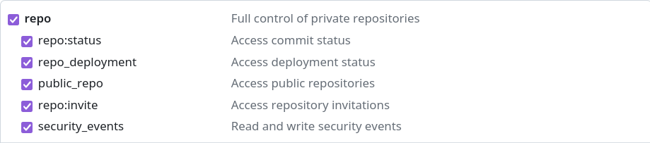

# Movie Challenge Planning CLI User Guide

This user guide provides instructions on how to use this CLI tool to create a planning for the Movie Challenge as a GitHub Project. The tool allows you to specify various parameters to tailor the planning according to your needs.

## Installation:

Before using the CLI tool, ensure that you have Node.js installed on your system. Then clone this repository in your computer.

## Usage:

Once cloned, open a terminal and locate it inside the folder created . You can use the CLI tool from the command line with the following syntax:

```bash
cd movie-challenge-planner
npm install
node src/planner.mjs [options]
```

### Options:

1. **-c, --cohort <value>**: Specify the Laboratoria cohort identifier. This should be in the format `DEVXXX` or `SAPXXX`.

2. **-t, --token <value>**: Provide your GitHub Personal Access Token. This token is required for authentication and authorization to interact with GitHub's API.

3. **-l, --lang <value>**: Select the language for the planning. Available choices are `"es"` (Spanish) and `"pt"` (Portuguese).

4. **-f, --framework <value>**: Choose the framework for the planning. Available choices are `"react"` and `"angular"`.

5. **-us, --user-story <number>**: Specify the user story number to plan. This is a numerical value corresponding to the user story you want to plan. Available choices are all and from 1 to 5. The default value is all.

6. **-d, --delay <number>**: Set the delay in seconds between GitHub API requests. Default delay is three seconds.

7. **-h, --help**: Display help information for the command.

## Example:

Here's an example command to create a planning for the Movie Challenge:

```bash
node src/planner.mjs -c DEV013 -t your_github_token -l es -f react -us 1
```

This command specifies the Laboratoria cohort `DEV013`, uses a GitHub Personal Access Token `your_github_token` for authentication, selects Spanish (`es`) as the language, chooses React (`react`) as the framework, specifies user story number `1` to plan and use the default value of `3` seconds for delay between API requests.

## Creating a GitHub Personal Access Token (Classic)

To use the movie challenge planner CLI, you'll need a **GitHub Personal Access Token (Classic)**. Here's how to create one:

1. **Sign in** to your GitHub account.
2. Click on your **profile picture** in the top right corner and select **"Settings"**.
3. In the left sidebar, navigate to **"Developer settings"**.
4. Under **"Tokens (classic)"**, click **"Generate new token (classic)"**.
5. **Name** your token descriptively (e.g., "Movie Challenge Planner").
6. **Set expiration** by chossing **"30 days"**.
7. **Select the scopes** your token needs. For this CLI, you'll likely need **"repo"** and **projects** permissions.

    

    

7. **Review** the permissions and click **"Generate token"**.
8. **Copy the generated token** and store it securely (never share it publicly).

**Important Note:**

* **Treat your personal access token like your password.** Do not share it with anyone and revoke it when you no longer need it.

Once you have your token, you can use it with the `-t` or `--token` option of the movie challenge planner CLI.
